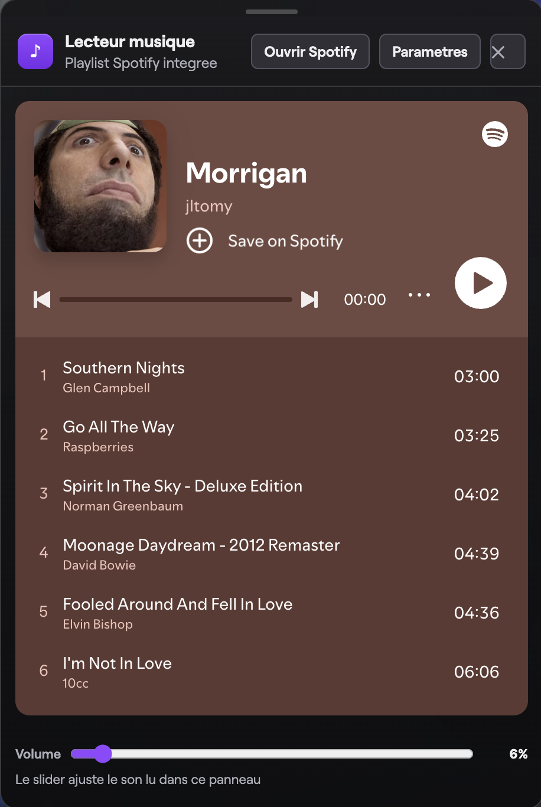

# Twitch Floating Music Panel


Extension Chrome (Manifest V3) qui ajoute un overlay musique sur Twitch:
- bouton flottant
- panneau Spotify integre
- slider volume reel pilote depuis l'overlay
- gestion de playlists + presets
- comportement adapte au fullscreen Twitch

## Sommaire

- Fonctionnalites
- Demo rapide
- Installation
- Utilisation
- Formats de lien playlist acceptes
- Comment ca fonctionne
- Permissions et pourquoi
- Vie privee
- Limitations connues
- Structure du projet
- Depannage
- Evolution possible
- Licence

## Fonctionnalites

- Bouton flottant en bas a gauche sur Twitch pour ouvrir/fermer le lecteur.
- Bouton Musique en fullscreen, positionne pres des controles Twitch.
- Le bouton fullscreen se masque quand l'UI Twitch disparait (idle UI).
- Lecteur Spotify embarque (iframe embed playlist).
- Panneau draggable (deplacable a la souris).
- Position du panneau conservee entre les sessions.
- Parametres de playlist:
  - changer le lien de playlist
  - revenir a la playlist par defaut
  - validation du lien
- Presets de playlists:
  - ajout d'un preset (nom + playlist courante)
  - activation d'un preset en 1 clic
  - suppression d'un preset
  - max 8 presets
  - preset actif visuellement surligne
- Slider volume reel dans l'overlay:
  - volume applique au son de l'onglet Twitch
  - persistance du volume en storage local

## Demo rapide

1. Ouvre Twitch dans Chrome.
2. Clique sur le bouton musique (icone note) en bas a gauche.
3. Clique sur Parametres pour changer la playlist.
4. Ajoute des presets pour switcher plus vite.
5. Ajuste le volume depuis le slider en bas du panneau.

## Installation

Prerequis:
- Chrome ou navigateur Chromium recent (Edge, Brave, etc.)
- mode Developpeur active dans la page Extensions

Installation locale (Load unpacked):

1. Clone le repo:

```bash
git clone <URL_DU_REPO>
cd extensiontomy
```

2. Ouvre la page extensions du navigateur:
- Chrome: `chrome://extensions`

3. Active le mode Developpeur (toggle en haut a droite).

4. Clique sur Charger l'extension non empaquetee.

5. Selectionne le dossier du projet (celui qui contient `manifest.json`).

6. Ouvre/recharge une page Twitch.

## Utilisation

### Ouvrir/Fermer le lecteur

- Bouton flottant musique en bas a gauche sur Twitch.
- Touche `Escape` pour fermer rapidement.

### Changer la playlist

1. Ouvre le panneau.
2. Clique Parametres.
3. Colle une URL Spotify playlist (ou URI/ID valide).
4. Clique Enregistrer.

### Utiliser les presets

1. Mets une playlist valide dans le champ.
2. (Optionnel) saisis un nom de preset.
3. Clique Ajouter.
4. Clique un preset pour l'activer.
5. Clique Suppr pour le retirer.

### Volume

- Le slider ajuste le volume du son de l'onglet Twitch capture.
- Ce n'est pas le volume global de l'application Spotify native.

### Fullscreen

- Un bouton Musique apparait en fullscreen Twitch.
- Il se cache avec l'UI Twitch quand le player devient idle.

## Formats de lien playlist acceptes

- URL classique:
  - `https://open.spotify.com/playlist/<ID_22_chars>`
- URL embed:
  - `https://open.spotify.com/embed/playlist/<ID_22_chars>`
- URI Spotify:
  - `spotify:playlist:<ID_22_chars>`
- ID brut (22 caracteres)

## Comment ca fonctionne

### 1) content.js

Injecte l'interface dans Twitch:
- boutons overlay
- panneau Spotify
- logique presets/settings
- drag and drop + persistance position
- appels runtime pour lire/appliquer le volume

### 2) background.js (service worker)

Orchestre la partie audio:
- recoit les messages get/set volume
- maintient un etat volume par onglet
- initialise la capture audio d'onglet
- cree/garantit le document offscreen

### 3) offscreen.js (+ offscreen.html)

Traite le flux audio en Web Audio API:
- creation AudioContext
- routage MediaStreamSource -> GainNode -> destination
- application du gain pour un vrai controle volume

## Permissions et pourquoi

- `storage`:
  - sauvegarder volume, playlist courante, presets
- `tabs`:
  - identifier et gerer l'onglet source
- `tabCapture`:
  - capturer l'audio de l'onglet Twitch pour appliquer le gain
- `offscreen`:
  - executer le traitement audio hors page visible
- `scripting`:
  - permission MV3 disponible dans le manifest
- `host_permissions: *://*.twitch.tv/*`:
  - injecter le content script uniquement sur Twitch

## Vie privee

- Aucune collecte de donnees vers un serveur externe.
- Aucune base distante.
- Donnees stockees localement via `chrome.storage.local` et `localStorage`.
- La capture audio sert uniquement a appliquer le volume dans l'onglet cible.

## Limitations connues

- Le volume pilote l'audio de l'onglet Twitch, pas le volume global Spotify desktop.
- Le placement fullscreen depend de la structure DOM Twitch et peut necessiter des ajustements si Twitch change ses classes/selecteurs.
- Extension pensee pour Twitch desktop web (pas testee pour mobile web).

## Structure du projet

```text
extensiontomy/
  manifest.json      # Config extension MV3
  content.js         # UI overlay Twitch + playlist + presets + interactions
  style.css          # Theme/UX Twitch-like
  background.js      # Service worker (volume + orchestration)
  offscreen.html     # Point d'entree offscreen
  offscreen.js       # Web Audio processing (GainNode)
```

## Depannage

### Le bouton overlay n'apparait pas

- Verifie que tu es bien sur un domaine `*.twitch.tv`.
- Recharge l'extension dans `chrome://extensions`.
- Recharge la page Twitch (hard reload).

### Le slider volume ne change rien

- Ouvre la console de la page et la page service worker (extensions) pour verifier les erreurs runtime.
- Verifie que le navigateur supporte bien `tabCapture` + `offscreen`.
- Recharge l'extension puis reteste.

### Playlist invalide

- Verifie le format du lien/URI/ID.
- Teste d'abord avec une URL Spotify playlist standard.

### Le bouton fullscreen est mal place

- Twitch change parfois son DOM/classes.
- Mettre a jour les selecteurs cibles dans `CHAT_TOGGLE_SELECTORS` de `content.js`.

---

## Licence

Ce projet est distribue sous la PolyForm Noncommercial License 1.0.0.

L'usage commercial n'est pas autorise, y compris:
- la vente de l'extension telle quelle ou modifiee
- l'integration dans une offre payante
- toute exploitation commerciale sans autorisation ecrite prealable

Voir:
- LICENSE
- NOTICE

